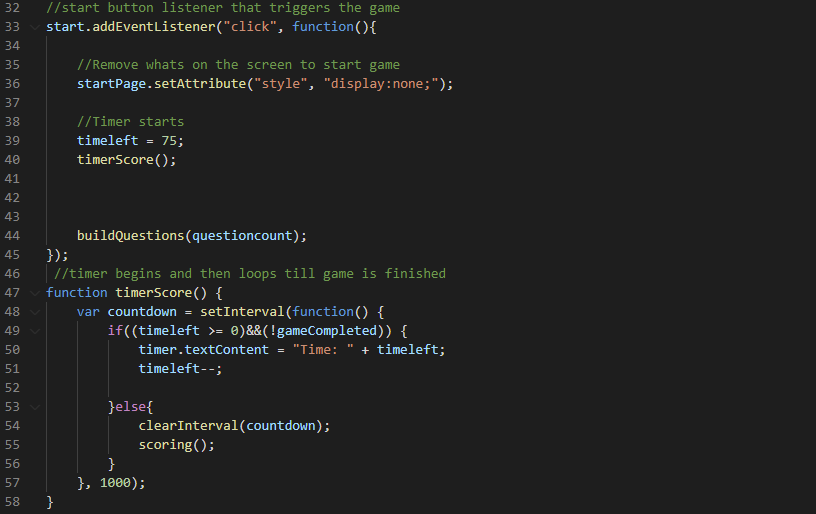
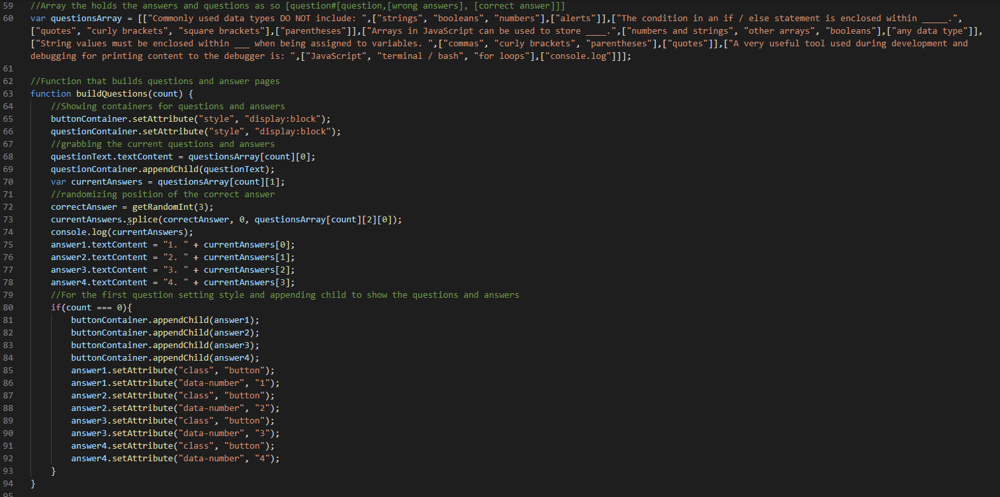

# programmingQuizAaronF
The way I approached this project was to have containers with content inside them for each stage of the quiz. 
Mainly the start page, questions page, the savescore page and the highscore page, I made the start page display none when the questionpage was ready to be made.
I had a timer function play as the game was still active.

I built the functions so that all that had to change to switch which question was being shown was the question count.

After all the questions it would stop the timer, that would be the score and it would ask for intials to save to an array(then to local storage).
Local storage and the view scores tab are incomplete. 
